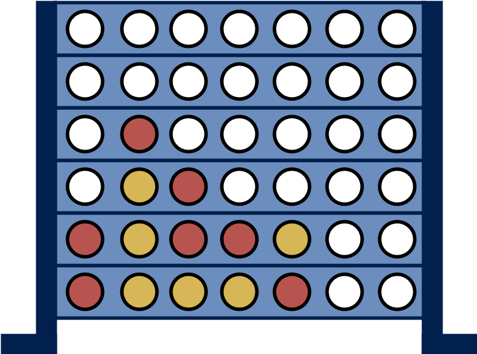

# Connect X - Monte Carlo Tree Search

## Introduction

Connect X is a two-player connection game in which the players take turns dropping colored discs from the top into a vertically suspended grid. The goal is to connect a specified number of these discs in a row horizontally, vertically, or diagonally before the opponent. The game offers strategic challenges and is often used as a benchmark problem in artificial intelligence research.

This repository contains the implementation of the Monte Carlo Tree Search (MCTS) algorithm to solve the Connect X game. MCTS is a popular algorithm in the domain of game-playing AI, and it has been successfully applied to various board games.

<p align="center">
  
</p>


## Monte Carlo Tree Search Algorithm

### Overview

Monte Carlo Tree Search is a decision-making algorithm used in decision processes with multiple stages, such as games. It consists of four main steps:

1. **Selection**: Starting from the root node, traverse the tree to find the most promising node based on some criteria. This is usually done by balancing exploration (visiting less-explored nodes) and exploitation (choosing nodes with high estimated value).

2. **Expansion**: Expand the selected node by adding one or more child nodes. This simulates the possible outcomes of a move from the selected state.

3. **Simulation (Rollout)**: Perform a simulation (or rollout) from the newly added node to a terminal state. This is typically done by making random moves until the end of the game or a predefined depth.

4. **Backpropagation**: Update the statistics of all nodes along the path from the expanded node to the root. This includes the number of visits and the accumulated value.

Repeat these steps iteratively, and the final decision is made based on the accumulated statistics.

### Connect X Adaptation

In the context of Connect X, the MCTS algorithm can be adapted as follows:

- **State Representation**: Represent the game state and moves appropriately for the Connect X game.
  
- **Selection Criteria**: Balance exploration and exploitation to choose the most promising moves.

- **Expansion**: Expand the tree by considering possible moves from the current state.

- **Simulation**: Simulate games from the expanded state to determine potential outcomes.

- **Backpropagation**: Update the statistics based on the results of the simulations.

## Requirements

To run the Connect X MCTS implementation, ensure you have the following dependencies installed:

- Python 3.11
- NumPy


Install the required packages using the following command:

```bash
pip install -r requirements.txt
